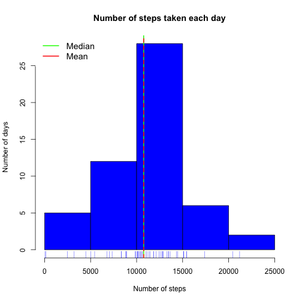

## Introduction

This assignment makes use of data from a personal activity monitoring device. The device collects data at 5 minute intervals through out the day. The data consists of two months of data from an anonymous individual collected during the months of October and November, 2012 and include the number of steps taken in 5 minute intervals each day.

The data for this assignment can be downloaded from the course web site:

Dataset: [Activity monitoring data](https://d396qusza40orc.cloudfront.net/repdata%2Fdata%2Factivity.zip) [52KB].

The variables included in this dataset are:

 * **steps**: Number of steps taking in a 5-minute interval (missing values are coded as NA)
 * **date**: The date on which the measurement was taken in YYYY-MM-DD format
 * **interval**: Identifier for the 5-minute interval in which measurement was taken

The dataset is stored in a comma-separated-value (CSV) file and there are a total of 17,568 observations in this dataset.

## Loading and preprocessing data

In this project I assume the reader will have installed and called libraries mentioned below:


```r
library(readr)
library(dplyr)
library(ggplot2)
```


First, the file needs to be downloaded:


```r
src <- "https://d396qusza40orc.cloudfront.net/repdata%2Fdata%2Factivity.zip"

dest <- file.path("data",basename(src))
if (!file.exists(dest))
        download.file(src,dest,method="curl",quiet=TRUE)
```


After downloading, the file is read in:


```r
my_raw_data <- read_csv(dest)
```

```
## Parsed with column specification:
## cols(
##   steps = col_integer(),
##   date = col_date(format = ""),
##   interval = col_integer()
## )
```


I leave the original data untouched and I will work on a cloned and modified dataset. I added two more columns to the data. One contains the name of the day for each date ("day_of_week"") and the second ("type_of_day"") is dividing data into weekday and weekend activity. They will be useful at a later time.


```r
activity <- my_raw_data %>% mutate(day_of_week = weekdays(date))
activity <- activity %>% mutate(type_of_day = factor(ifelse(activity$day_of_week %in% c("Saturday", "Sunday"), "weekend", "weekday")))
```


The data set looks like this:


```r
head(activity)
```

```
## # A tibble: 6 <U+00D7> 5
##   steps       date interval day_of_week type_of_day
##   <int>     <date>    <int>       <chr>      <fctr>
## 1    NA 2012-10-01        0      Monday     weekday
## 2    NA 2012-10-01        5      Monday     weekday
## 3    NA 2012-10-01       10      Monday     weekday
## 4    NA 2012-10-01       15      Monday     weekday
## 5    NA 2012-10-01       20      Monday     weekday
## 6    NA 2012-10-01       25      Monday     weekday
```


I have also prepared a few modified datasets for future use:


```r
full_activity <- activity #cloned dataset with NAs
steps_per_day <- activity %>% group_by(date) %>% summarize(sum_of_steps = sum(steps)) 
interval_series <- activity %>% group_by(interval) %>% summarize(average_steps = mean(steps,na.rm=TRUE))
interval_day_series <- activity %>% group_by(interval,day_of_week) %>% summarize(average_steps = mean(steps,na.rm=TRUE))
```


### What is mean total number of steps taken per day?

The mean total number of steps taken each day is calculated in the dataset "steps_per_day". This dataset still contains missing values. The histogram of the mean total number of steps taken each day is presented below:


```r
hist(steps_per_day$sum_of_steps,col="blue", xlab="Number of steps", ylab="Number of days", main="Number of steps taken each day")
rug(steps_per_day$sum_of_steps,col="blue")
abline(v=median(steps_per_day$sum_of_steps,na.rm=TRUE),lty=1,lwd=2,col="green")
abline(v=mean(steps_per_day$sum_of_steps,na.rm=TRUE),lty=2,lwd=2,col="red")
legend("topleft",lwd=2,col=c("green","red"),c("Median","Mean"), cex=1.2,box.lwd=0)
```




Median and mean are calculate as:


```r
steps_mean = mean(steps_per_day$sum_of_steps,na.rm=TRUE)
steps_median = median(steps_per_day$sum_of_steps,na.rm=TRUE)
```


The mean for this distribution is **10766.19** and the median is **10765**.

### What is the average daily activity pattern?

The following time-series plot represents average number of steps taken in a 5-minute interval.


```r
with(interval_series, plot(interval,average_steps,type="l",col="red", ylab="average number of steps taken in a 5 minute interval"))
```


### Which 5-minute interval, on average across all the days in the dataset, contains the maximum number of steps?


```r
max <- which.max(interval_series$average_steps)
interval_series[max,]
```

```
## # A tibble: 1 <U+00D7> 2
##   interval average_steps
##      <int>         <dbl>
## 1      835      206.1698
```


The interval **835** has the maximum average value of steps **206.1698**.

### Imputing missing values

The missing values are only in the column of steps.


```r
sum(is.na(activity$steps))
```

```
## [1] 2304
```


There are **2304** rows with missing values.

I decided to fill missing values based on the average number of steps in a given interval for a corresponding day of the week.


```r
for (i in 1:nrow(full_activity)) {
        if (is.na(full_activity$steps[i])) {
                fill_interval <- full_activity$interval[i] #find the interval of the missing steps
                fill_day <- full_activity$day_of_week[i] #fing the week day of the missing steps
                interval_row  <- 
                        interval_day_series[interval_day_series$interval == fill_interval & interval_day_series$day_of_week == fill_day,] 
                full_activity$steps[i] = interval_row$average_steps #find the average number of steps in this interval for this day of week
        }
}
```


For this dataset the distribution of the mean total number of steps taken each day is presented in the following plot:


```r
steps_per_day_full <- full_activity %>% 
        group_by(date) %>% 
        summarize(sum_of_steps = sum(steps))

hist(steps_per_day_full$sum_of_steps,col="steelblue", xlab="Number of steps", ylab="Number of days", main="Number of steps taken each day")
rug(steps_per_day_full$sum_of_steps,col="steelblue")
abline(v=median(steps_per_day_full$sum_of_steps),lty=1,lwd=2,col="green")
abline(v=mean(steps_per_day_full$sum_of_steps),lty=2,lwd=2,col="red")
legend("topleft",lwd=2,col=c("green","red"),c("Median","Mean"), cex=1.2,box.lwd=0)
```


Median and mean for this histogram are calculated as:


```r
steps_mean_full = mean(steps_per_day_full$sum_of_steps)
steps_median_full = median(steps_per_day_full$sum_of_steps)
```

The mean is **10821.21** and the median is **11015**. They are higher than in the dataset with missing values (**10766.19** and **10765**, respectively), which is an expected effect.

### Are there differences in activity patterns between weekdays and weekends?

The panel of plots below represents average number of steps taken in a 5-minute interval during weekdays and weekends. It looks like there is more general activity (more intervals with higher average number of steps) during the weekend, while during weekdays the activity peaks in the morning (perhaps morning jogging).


```r
interval_week_series <- full_activity %>% 
        group_by(interval,type_of_day) %>% 
        summarize(average_steps = mean(steps))

qplot(interval,average_steps,data=interval_week_series,geom="line",facets=type_of_day~.,color=type_of_day,show.legend=FALSE)+facet_wrap(~ type_of_day, ncol = 1)+xlab("Interval")+ylab("Average number of steps per interval")
```


